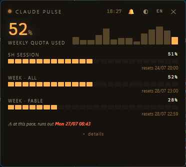
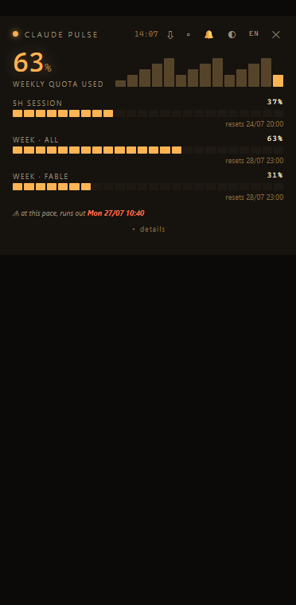

# 🟠 Claude Pulse

[](https://github.com/Masterjbrito/claude-pulse/actions)
[](https://github.com/Masterjbrito/claude-pulse/stargazers)
[](LICENSE)
[](https://python.org)

A tiny always-on-top desktop widget for Windows that monitors your **Claude Code** usage in real time — quota limits, per-model and per-project spend, with sound alerts.

> **English** · [Português](#-português) · [Español](#-español) · [Français](#-français) · [Deutsch](#-deutsch)






## Features

- **Real quota meters** — the actual 5-hour session and weekly limit percentages from your Claude subscription (same data as `/usage`), including per-model limits when your plan has them
- **API-equivalent cost** — what your usage *would* cost at API prices (you pay a flat subscription; this is a volume ruler, not a bill)
- **Per-model breakdown** — Opus, Sonnet, Haiku, … with input/output/cache tokens
- **Top 10 projects** — see which project burns the most quota this month
- **Depletion forecast** — "at this pace, your weekly quota runs out Mon 08:43"
- **System tray icon** showing the weekly % (turns red ≥80%), with native toast notifications on alerts
- **14-day sparkline** + last-8-weeks history chart, auto-refresh every 30 s
- **Sound alerts** at 80% (soft) and 95% (urgent) of any limit — thresholds configurable in-app, mutable 🔕
- **Mini mode** ▫ — shrink to a tiny draggable % badge
- **CSV/JSON export** ⇩ — day × model × project aggregates straight to your Downloads
- **Auto-update check** — a link appears when a newer release is out
- **5 color themes** (amber, matrix, ice, magma, paper) — click ◐ to cycle
- **5 languages** (EN, PT, ES, FR, DE) — auto-detected, click the language code to cycle
- Frameless, draggable, always-on-top, ~30 MB RAM

## Requirements

- Windows 10/11
- Python 3.10+
- [Claude Code](https://claude.com/claude-code) installed and used locally (data is read from `~/.claude/projects/`)

## Install (one click)

- **Windows**: double-click `install-windows.bat` — installs dependencies, registers autostart, launches the widget
- **macOS**: `bash install-mac.sh` — installs dependencies, registers a LaunchAgent (autostart), launches the widget

Manual run:

```powershell
pip install -r requirements.txt
python claude_pulse.py
```

Or via pipx:

```bash
pipx install git+https://github.com/Masterjbrito/claude-pulse
claude-pulse
```

Developing the UI without a backend? Open `ui/index.html?demo=1` in any browser for fake data.

On startup the widget **speaks a short voice summary** of your quotas (in your language); mute 🔕 disables both sounds and voice.

## How it works

- Usage data: parses the JSONL transcripts Claude Code writes to `~/.claude/projects/`, incrementally (only changed files are re-read)
- Limits: fetched from the same OAuth endpoint the `/usage` command uses, with your local Claude Code session token. This endpoint is **undocumented** and may change; if it does, the widget shows "limits unavailable" and everything else keeps working
- Nothing leaves your machine except that one HTTPS call to `api.anthropic.com`

## Customizing colors

Themes live in `ui/index.html` in the `THEMES` object — each is 8 hex values:

```js
mytheme: {bg:'#16130F', panel:'#1E1913', line:'#2E2721', accent:'#FFB454',
          dim:'#8A6B3F', ink:'#F2E8DA', mut:'#9A8C78', hot:'#FF6A4D'},
```

Add your own and it joins the ◐ cycle automatically.

## Custom alert soundbites (optional)

Alerts speak witty phrases by default. If you prefer your own sound clips, create a `sounds/` folder next to `claude_pulse.py` with any of:

- `doh.mp3` — played at 80% of any limit
- `fatality.mp3`, `gameover.mp3`, `hasta.mp3` — one picked at random at 95%

The folder is gitignored — bring your own audio (mind copyright if you redistribute).

## Limitations

- Covers **Claude Code** (VS Code / terminal) only — the Claude desktop chat app does not expose usage data
- Dollar figures are API-price equivalents, not what you pay on a subscription

---

## 🇵🇹 Português

Widget de ambiente de trabalho (Windows) sempre visível que monitoriza o uso do **Claude Code** em tempo real: medidores reais dos limites (sessão 5h, semanal e por modelo), custo equivalente API, uso por modelo e por projeto, alertas sonoros a 80%/95% (com mute), 5 temas de cores e 5 idiomas.

```powershell
pip install -r requirements.txt
python claude_pulse.py
```

Sem consola: duplo-clique em `ClaudePulse.vbs`. Arranque com o Windows: copiar o `.vbs` para `shell:startup`.

## 🇪🇸 Español

Widget de escritorio (Windows) siempre visible que monitoriza el uso de **Claude Code** en tiempo real: medidores reales de límites (sesión 5h, semanal y por modelo), coste equivalente API, uso por modelo y por proyecto, alertas sonoras al 80%/95% (silenciables), 5 temas de color y 5 idiomas.

## 🇫🇷 Français

Widget de bureau (Windows) toujours visible qui surveille l'utilisation de **Claude Code** en temps réel : jauges réelles des limites (session 5h, hebdomadaire et par modèle), coût équivalent API, usage par modèle et par projet, alertes sonores à 80%/95% (désactivables), 5 thèmes de couleurs et 5 langues.

## 🇩🇪 Deutsch

Immer sichtbares Desktop-Widget (Windows), das die Nutzung von **Claude Code** in Echtzeit überwacht: echte Limit-Anzeigen (5h-Sitzung, wöchentlich und pro Modell), API-äquivalente Kosten, Nutzung pro Modell und Projekt, Tonwarnungen bei 80%/95% (stummschaltbar), 5 Farbthemen und 5 Sprachen.

---

## Star History

[](https://star-history.com/#Masterjbrito/claude-pulse&Date)

---

MIT License · Not affiliated with Anthropic.
